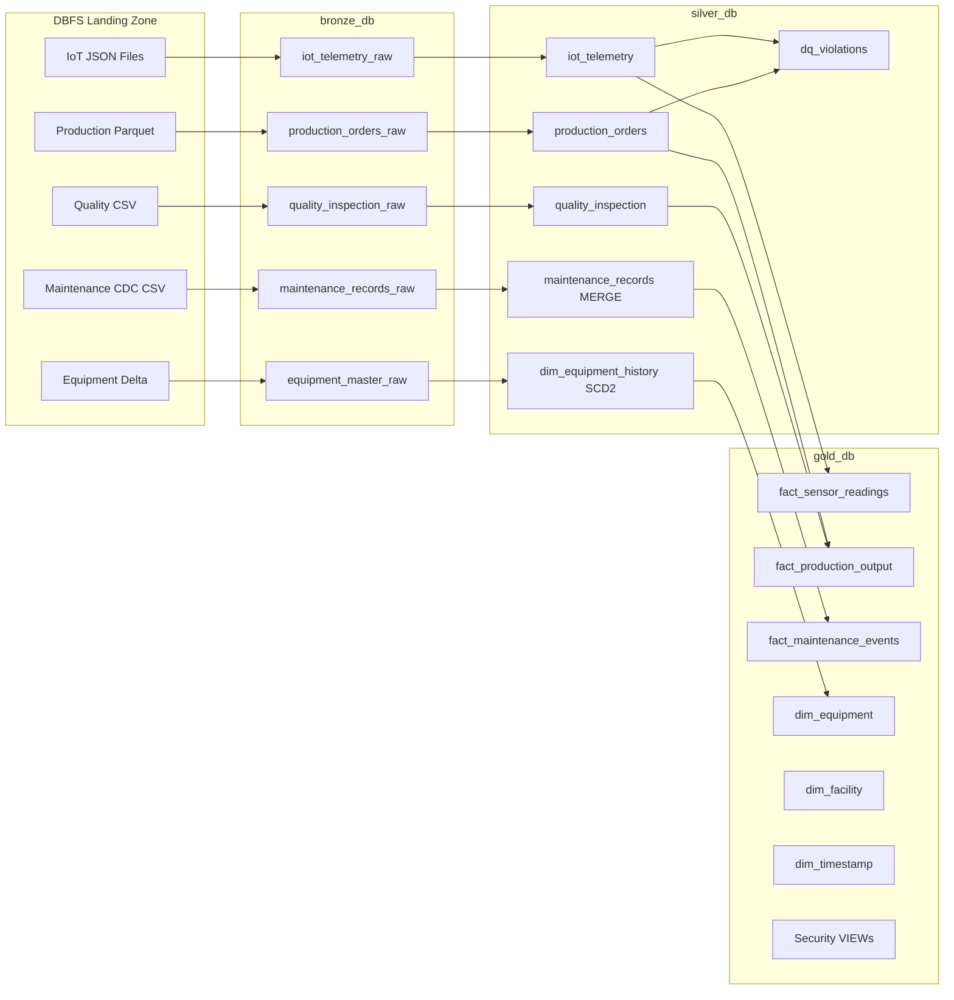

# Smart Manufacturing IoT Lakehouse — Hackathon Implementation
### Databricks Lakehouse | End-to-End Data Engineering Solution

# 0. Environment Setup Instructions

To run this project end-to-end inside Databricks Community Edition, follow the steps below.

---

## Step 1 — Extract Project Files

- Download the project `.zip` file.
- Extract all contents locally.
- Ensure the extracted folder contains:
  - 10 notebook files (`.ipynb`)
  - 1 `README.md`

---

## Step 2 — Import into Databricks

1. Log in to your Databricks workspace.
2. Navigate to **Workspace**.
3. Click **Import**.
4. Upload:
   - All 10 notebook files  
   - The `README.md` file  

After importing, ensure all notebooks are located in the same workspace folder.

---

## Step 3 — Open the Master Orchestration Notebook

Open:

`MASTER_Pipeline_Runner.ipynb`

This notebook orchestrates the complete Bronze → Silver → Gold pipeline.

---

## Step 4 — Select a Cluster

1. At the top-right of the notebook, click the **Compute / Cluster selector**.
2. Select an active cluster.
   - In Community Edition, choose the default available cluster.
3. Wait until the cluster status shows **Running**.

---

## Step 5 — Execute the Pipeline

- Click **Run All**.

The pipeline will execute sequentially:

1. Database setup  
2. Data generation  
3. Bronze ingestion  
4. Silver cleansing & validation  
5. Gold dimensional modeling  
6. Security simulation  
7. Optimization  
8. Testing & validation  

The execution will stop automatically if any notebook fails.

---

## Table of Contents
1. Document Summary
2. Implemented Architecture Overview
3. Assumptions & Scope
4. Architecture Overview
5. Medallion Layer Definitions
6. Folder & Notebook Structure
7. Phase-by-Phase Implementation
8. Data Schemas & Synthetic Data Strategy
9. Pipeline Design: Bronze → Silver → Gold
10. Security & Governance Simulation
11. Performance Optimization Strategy
12. Testing & Validation Plan
13. Orchestration Design
14. Architecture Diagram (Mermaid)
15. Potential Challenges & Mitigations
16. Best Practices Followed

---

# 1. Document Summary

## Problem Statement

Design and implement a governed, scalable Lakehouse platform for a smart manufacturing company capable of:

- Ingesting IoT telemetry and operational datasets  
- Preserving raw data integrity  
- Enforcing data quality rules  
- Building a dimensional model for analytics  
- Simulating row-level and column-level security  
- Optimizing performance using Delta Lake  

This implementation focuses on Medallion architecture using Databricks.

---

# 2. Implemented Architecture Overview

Unlike the original enterprise plan (DLT, Unity Catalog, Azure integrations), this implementation uses:

- Databricks workspace catalog: `sparkwars`
- Schemas:
  - `sparkwars.bronze`
  - `sparkwars.silver`
  - `sparkwars.gold`
- Delta Lake for all storage
- Notebook-based orchestration
- SQL views for security simulation

No external Azure services are used.

---

# 3. Assumptions & Scope

### A1 — Synthetic Data Generation
All datasets are generated using PySpark and random functions inside Databricks.

### A2 — Batch Ingestion
Data ingestion is implemented using batch processing (no Structured Streaming).

### A3 — No CDC / SCD2
Change Data Capture and SCD Type 2 logic are not implemented in this version.

### A4 — Security Simulation
Row-Level and Column-Level security are implemented via SQL views.

---

# 4. Architecture Overview

```
╔══════════════════════════════════════════════╗
║          Synthetic Data Generator           ║
╚══════════════════════════════════════════════╝
                      │
                      ▼
╔══════════════════════════════════════════════╗
║           BRONZE LAYER (sparkwars.bronze)   ║
║  Raw Delta Tables (Append-Only)             ║
╚══════════════════════════════════════════════╝
                      │
                      ▼
╔══════════════════════════════════════════════╗
║           SILVER LAYER (sparkwars.silver)   ║
║  Cleansed + Validated + DQ Tagged           ║
╚══════════════════════════════════════════════╝
                      │
                      ▼
╔══════════════════════════════════════════════╗
║           GOLD LAYER (sparkwars.gold)       ║
║  Star Schema Dimensional Model              ║
╚══════════════════════════════════════════════╝
                      │
                      ▼
╔══════════════════════════════════════════════╗
║         Security Views + Analytics          ║
╚══════════════════════════════════════════════╝
```

---

# 5. Medallion Layer Definitions

## Bronze Layer

**Purpose:** Preserve source data as received.

Characteristics:

- Append-only Delta tables  
- No transformation logic  
- Raw schema retention  
- Basic metadata columns  

Tables:

- `iot_telemetry_raw`
- `production_orders_raw`
- `maintenance_records_raw`
- `quality_inspection_raw`
- `equipment_master_raw`

---

## Silver Layer

**Purpose:** Cleanse and validate data.

Transformations include:

- Null checks  
- Range validations  
- Required field enforcement  
- Data Quality tagging  
- Referential integrity checks  
- Pipeline run tracking  

Additional columns:

```
_dq_passed
_violation_reason
pipeline_run_id
```

Failed records are routed to dedicated DQ tables.

---

## Gold Layer

**Purpose:** Provide analytics-ready dimensional model.

Design:

- Surrogate keys (IDENTITY columns)  
- Fact + Dimension separation  
- Star schema modeling  

Dimensions:

- dim_facility  
- dim_timestamp  

Facts:

- fact_sensor_readings  
- fact_production_output  
- fact_maintenance_events  

---

# 6. Folder & Notebook Structure

```
Create_Databases.ipynb
Data_Generator.ipynb
Bronze_Layer_Data_Ingestion.ipynb
Silver_Layer_Cleansing_and_Validation.ipynb
DQ_Reporting.ipynb
Gold_Facts_and_Dim.ipynb
Security_Simulation.ipynb
Optimization_Script.ipynb
Testing_and_Validation.ipynb
MASTER_Pipeline_Runner.ipynb
```

Each notebook represents a specific architectural layer.

---

# 7. Phase-by-Phase Implementation

## Phase 0 — Setup

- Create catalog & schemas
- Initialize Delta structure

## Phase 1 — Data Generation

- Generate synthetic IoT telemetry
- Generate production & maintenance data
- Write to managed storage paths

## Phase 2 — Bronze Ingestion

- Load raw files
- Append to Bronze Delta tables
- No transformation applied

## Phase 3 — Silver Cleansing

IoT Rules Implemented:

| Rule | Logic |
|------|-------|
| device_id NOT NULL | Required |
| event_timestamp NOT NULL | Required |
| facility_id NOT NULL | Required |
| temperature -50 to 150 | Range |
| vibration_x 0 to 100 | Range |

Referential integrity check example:

```sql
SELECT qi.order_id
FROM sparkwars.silver.quality_inspection qi
LEFT ANTI JOIN sparkwars.silver.production_orders po
ON qi.order_id = po.order_id;
```

## Phase 4 — Gold Modeling

Example Fact Table:

```sql
CREATE TABLE sparkwars.gold.fact_sensor_readings (
  sensor_reading_sk BIGINT GENERATED ALWAYS AS IDENTITY,
  equipment_sk BIGINT,
  facility_sk BIGINT,
  timestamp_sk INT,
  temperature DOUBLE,
  vibration_x DOUBLE
) USING DELTA;
```

---

# 8. Data Schemas & Synthetic Data Strategy

IoT synthetic generation includes:

- Random facility assignment
- Random equipment types
- Recent timestamps
- Controlled metric distributions
- Intentional anomalies for DQ testing

This allows validation of cleansing logic.

---

# 9. Pipeline Design: Bronze → Silver → Gold

```
Data Generator
    ↓
Bronze (Raw Delta)
    ↓
Silver (Validated + DQ)
    ↓
Gold (Star Schema)
    ↓
Security Views
```

All writes use Delta Lake.

---

# 10. Security & Governance Simulation

## Row-Level Security (RLS)

```sql
CREATE OR REPLACE VIEW sparkwars.gold.vw_analyst_sensor_readings AS
SELECT *
FROM sparkwars.gold.fact_sensor_readings
WHERE facility_sk IN (
  SELECT facility_sk
  FROM sparkwars.gold.dim_facility
  WHERE facility_id = current_user()
);
```

## Column-Level Security (CLS)

```sql
CONCAT(LEFT(maintenance_technician_id, 5), '***')
```

Separate views created for analysts and engineers.

---

# 11. Performance Optimization Strategy

### OPTIMIZE + ZORDER

```sql
OPTIMIZE sparkwars.silver.iot_telemetry
ZORDER BY (device_id, event_timestamp);
```

### Table Properties

```
delta.autoOptimize.optimizeWrite = true
delta.autoOptimize.autoCompact = true
delta.targetFileSize = 134217728
```

Objectives:

- Reduce small files  
- Improve data skipping  
- Optimize join performance  

---

# 12. Testing & Validation Plan

Validation includes:

| Test | Purpose |
|------|---------|
| Source vs Bronze row count | Ensure ingestion integrity |
| Schema validation | Schema consistency |
| Equipment table match | Raw vs Bronze consistency |
| DQ violation routing | Ensure failed records isolated |

Example:

```python
if bronze_count != source_count:
    print("WARNING: Row count mismatch")
```

---

# 13. Orchestration Design

`MASTER_Pipeline_Runner.ipynb`:

- Generates UUID `pipeline_run_id`
- Executes notebooks sequentially
- Logs execution time
- Stops on failure

Example:

```python
dbutils.notebook.run("Silver_Layer_Cleansing_and_Validation", 0)
```

Provides deterministic execution flow.

---

# 14. Architecture Diagram (Mermaid)


---

# 15. Potential Challenges & Mitigations

| Challenge | Mitigation |
|------------|------------|
| Single-node environment | Controlled dataset size |
| No enterprise RBAC | SQL view simulation |
| No streaming | Batch ingestion approach |
| No CDC/SCD2 | Scope limited to core Medallion pattern |

---

# 16. Best Practices Followed

- Strict Medallion separation  
- All tables stored as Delta  
- Surrogate keys in Gold  
- Dedicated DQ violation tables  
- ZORDER applied to high-cardinality columns  
- Notebook-based modular design  
- Re-runnable, idempotent execution  

---

# Conclusion

This implementation demonstrates:

- Lakehouse architecture design  
- Data Quality engineering  
- Dimensional modeling  
- Security simulation  
- Delta optimization  
- Pipeline orchestration  
- Validation strategy  

It reflects practical Data Engineering patterns suitable for enterprise-scale analytics platforms.


